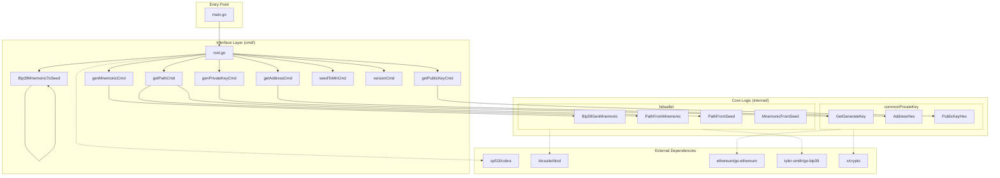

# gowallet Architecture

`gowallet` follows a standard Go CLI application architecture, emphasizing separation of concerns between the command-line interface and the core business logic.

## High-Level Overview

The project is structured into three main layers:

1.  **Entry Point**: `main.go` bootstraps the application.
2.  **Interface Layer (`cmd/`)**: Built with [Cobra](https://github.com/spf13/cobra). Handles argument parsing, flags, and user interaction.
3.  **Domain/Logic Layer (`internal/`)**: Contains the core cryptographic and wallet logic, isolated from the CLI interface.

## Architecture Diagram



## Module Description

### `cmd`
Responsible for the CLI user experience.
- **`root.go`**: Defines the base command and global configuration.
- **`genPrivateKey.go`**: Commands for single-key operations (ETH style keys)
    - `genPrivateKey`: Generate random private keys
    - `getAddress`: Derive address from private key
    - `getPublicKey`: Derive public key from private key
- **`hdwallet.go`**: Commands for Hierarchical Deterministic (HD) wallet operations (BIP39/32/44)
    - `genMnemonic`: Generate BIP39 mnemonic phrases
    - `mnToSeed`: Convert mnemonic to seed
    - `getPath`: Derive keys from mnemonic or seed using derivation paths
    - `seedToMn`: Generate mnemonic from seed/entropy
- **`version.go`**: Outputs build version, git commit, and build time

### `internal`
Contains the business logic. Code here is not importable by external projects, ensuring encapsulation.

- **`commonPrivateKey`**:
    - Handles random private key generation using `crypto/rand`
    - Converts private keys to Public Keys (ECDSA/Secp256k1)
    - Derives Ethereum addresses from public keys
    - Transaction signing (EIP155 and latest standards)
    - Message signing capabilities
    - **`validation.go`**: Private key strength validation

- **`hdwallet`**:
    - Implements BIP39 (Mnemonic generation and validation)
    - Implements BIP32 (Hierarchical Deterministic Wallets)
    - Handles derivation paths (e.g., `m/44'/60'/0'/0/0` for Ethereum)
    - Supports both mnemonic-based and seed-based key derivation
    - Cross-chain address generation
    - **`validation.go`**: Derivation path and entropy quality validation

- **`security`**:
    - **`memory.go`**: Secure memory zeroing utilities for sensitive data

## Testing

The project includes comprehensive test coverage:

### Test Structure
- **Unit Tests**: Located in `*_test.go` files alongside source code
- **Integration Tests**: CLI command testing in `cmd/cmd_test.go`
- **Test Coverage**: Covers critical paths, edge cases, and error handling

### Running Tests
```bash
# Run all tests
go test ./...

# Run with verbose output
go test ./... -v

# Run specific package
go test ./internal/hdwallet -v
go test ./internal/commonPrivateKey -v

# Run with coverage
go test ./... -cover

# Generate coverage report
go test ./... -coverprofile=coverage.out
go tool cover -html=coverage.out

# Run benchmarks
go test ./internal/hdwallet -bench=.
```

### Key Test Files
- `internal/commonPrivateKey/commonPrivateKey_test.go`: Private key operations
- `internal/hdwallet/mnemonic_test.go`: BIP39 mnemonic tests
- `internal/hdwallet/pathFromMnemonic_test.go`: HD wallet path derivation
- `internal/hdwallet/pathFromSeed_test.go`: Seed-based derivation
- `internal/hdwallet/mnemonicFromSeed_test.go`: Mnemonic generation
- `cmd/cmd_test.go`: CLI integration tests

## Build Process

### Development Build
```bash
go build -o gowallet main.go
```

### Production Build (with version info)
```bash
make build
```

The build process injects:
- Version from git tags and commit count
- Git commit hash
- Build timestamp

### CI/CD
The project uses GitHub Actions for:
- Automated builds for multiple platforms (Linux, macOS, Windows)
- ARM64 support (darwin/arm64, windows/arm64, linux/arm64)
- Automatic releases with checksums
- Version information embedded in binaries

## Security Considerations

### Cryptographic Security
- Private keys are generated using Go's `crypto/rand` package (CSPRNG)
- Mnemonic generation follows BIP39 specification
- HD wallet derivation follows BIP32 and BIP44 standards
- All cryptographic operations use well-tested libraries
- No private key material is logged or persisted by the tool

### Built-in Validations

**Private Key Validation** (`commonPrivateKey/validation.go`):
- Ensures keys are within valid range [1, n-1] where n is curve order
- Detects potentially weak keys (< 1000, theoretical only)
- Validates keys don't exceed secp256k1 curve order

**Entropy Quality Check** (`hdwallet/validation.go`):
- Minimum 128 bits entropy for BIP39
- Detects all-zero entropy (weak randomness)
- Hamming weight check: ensures 40-60% ones in binary representation
- Catches obvious non-random patterns

**Derivation Path Validation** (`hdwallet/validation.go`):
- Validates BIP32 format: `m/level1/level2/.../levelN`
- Enforces maximum depth (10 levels)
- Validates BIP44 purpose codes (44, 49, 84)
- Ensures path components are valid non-negative integers

**Memory Safety** (`security/memory.go`):
- Sensitive data (entropy, seeds) are zeroed after use
- Prevents data leakage through memory dumps
- Uses explicit zeroing before garbage collection

## Development Guidelines

### Code Quality
- Error handling: All errors are properly checked and wrapped
- Comments: Public APIs are documented
- Testing: New features require corresponding tests
- Linting: Code passes `go vet` and follows Go best practices

### Adding New Commands
1. Define command in `cmd/` directory
2. Implement business logic in `internal/`
3. Add tests for both CLI interface and core logic
4. Update help documentation and examples
5. Add usage examples to README

